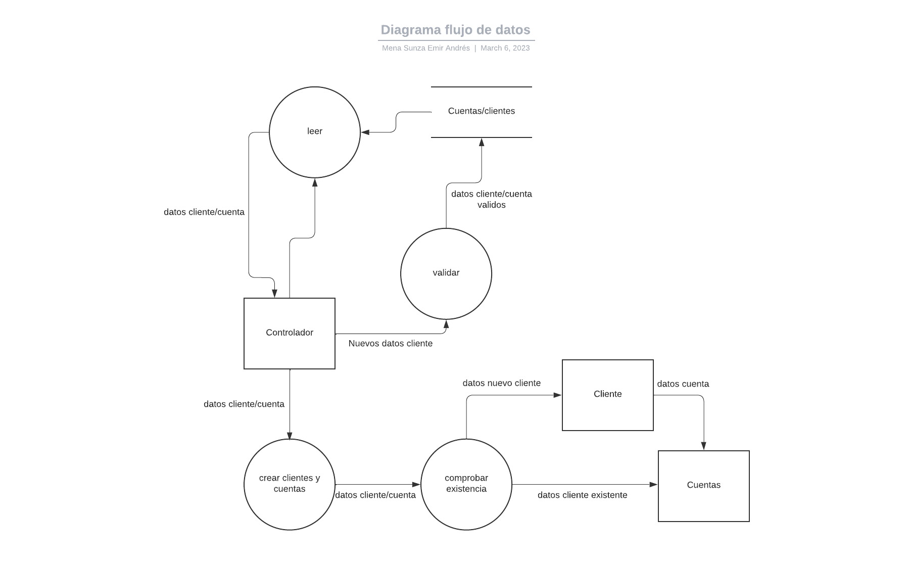

# Dise-o-Agrega-Cliente
Artefactos necesarios para la creación de programa bancario y la funcionalidad "agregar cliente"

<h2>Historias de usuario</h2>

<h3 align="center">Historias de usuario</h3>

**Titulo** Agregar clientes
________________________________________________________________________________________________________________

**Como** usuario
________________________________________________________________________________________________________________

**Deseo** agregar clientes a una base de datos o archivo al proporcionar los datos del mismo
________________________________________________________________________________________________________________

**Para** poder visualizarlo en forma de lista, incluyendo los datos del cliente
________________________________________________________________________________________________________________

<h3 align="center">Diagrama de flujo de datos </h3>

